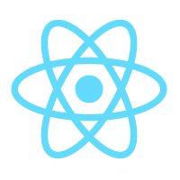

<!-- Improved compatibility of back to top link: See: https://github.com/rayanthoney/ram_movie_app/pull/73 -->
<a id="readme-top"></a>

<!-- ABOUT THE PROJECT -->
## About The Project

[![Product Name Screen Shot][product-screenshot]](https://example.com)

<br>
<div align="center">
   <a href="https://github.com/rayanthoney/ram_movie_app">
    
  </a>

  <h3 align="center">Welcome to your Expo app 👋</h3>

   <p align="center">
    This is an Expo project created with create-expo-app.
    <br />
    <a href="https://github.com/rayanthoney/ram_movie_app"><strong>Explore the docs »</strong></a>
    <br />
    <br />
    <a href="https://github.com/rayanthoney/ram_movie_app">View Demo</a>
    &middot;
    <a href="https://github.com/rayanthoney/ram_movie_app/issues/new?labels=bug&template=bug-report---.md">Report Bug</a>
    &middot;
    <a href="https://github.com/rayanthoney/ram_movie_app/issues/new?labels=enhancement&template=feature-request---.md">Request Feature</a>
  </p>

</div>

<p align="right">(<a href="#readme-top">back to top</a>)</p>

<!-- MARKDOWN LINKS & IMAGES -->
<!-- https://www.markdownguide.org/basic-syntax/#reference-style-links -->
[product-screenshot]: assets/images/adaptive-icon.png
[Next.js]: https://img.shields.io/badge/next.js-000000?style=for-the-badge&logo=nextdotjs&logoColor=white
[Next-url]: https://nextjs.org/

<!-- 
## Get started

1. Install dependencies

   ```bash
   npm install
   ```

2. Start the app

   ```bash
    npx expo start
   ```

In the output, you'll find options to open the app in a

- [development build](https://docs.expo.dev/develop/development-builds/introduction/)
- [Android emulator](https://docs.expo.dev/workflow/android-studio-emulator/)
- [iOS simulator](https://docs.expo.dev/workflow/ios-simulator/)
- [Expo Go](https://expo.dev/go), a limited sandbox for trying out app development with Expo

You can start developing by editing the files inside the **app** directory. This project uses [file-based routing](https://docs.expo.dev/router/introduction).

## Get a fresh project

When you're ready, run:

```bash
npm run reset-project
```

This command will move the starter code to the **app-example** directory and create a blank **app** directory where you can start developing.

## Learn more

To learn more about developing your project with Expo, look at the following resources:

- [Expo documentation](https://docs.expo.dev/): Learn fundamentals, or go into advanced topics with our [guides](https://docs.expo.dev/guides).
- [Learn Expo tutorial](https://docs.expo.dev/tutorial/introduction/): Follow a step-by-step tutorial where you'll create a project that runs on Android, iOS, and the web.

## Join the community

Join our community of developers creating universal apps.

- [Expo on GitHub](https://github.com/expo/expo): View our open source platform and contribute.
- [Discord community](https://chat.expo.dev): Chat with Expo users and ask questions. -->
