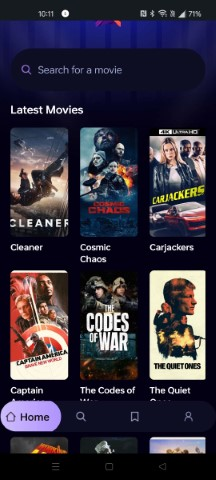

<!-- Improved compatibility of back to top link: See: https://github.com/rayanthoney/ram_movie_app/pull/73 -->

<!-- ABOUT THE PROJECT -->
## About The Project

<!-- [![Product Name Screen Shot][product-screenshot]](https://example.com) -->

<!-- link to project -->
    <a href='-URL TO DEMO GOES HERE-'>
    <!-- link to local image -->
        
    </a>

 

   

  <h3 align="center">Welcome to your Expo app 👋</h3>

   

    A Movie Finding App with Extensive Search.
     
    <a href="https://github.com/rayanthoney/ram_movie_app"><strong>Explore the docs »</strong></a>
     
     
    <a href="https://github.com/rayanthoney/ram_movie_app">View Demo</a>
    &middot;
    <a href="https://github.com/rayanthoney/ram_movie_app/issues/new?labels=bug&template=bug-report---.md">Report Bug</a>
    &middot;
    <a href="https://github.com/rayanthoney/ram_movie_app/issues/new?labels=enhancement&template=feature-request---.md">Request Feature</a>
  

 

<!-- Tech Stack -->

## ⚙️ Tech Stack

 

[![React Native][React_Native]][React_Native-url]
[![Expo][Expo]][Expo-url]
[![TypeScript][TypeScript]][TypeScript-url]
[![TailWind CSS][TailWind]][TailWind-url]
[![Appwrite][Appwrite]][Appwrite-url]
 
 

## 🔋 Features

### Features of the Mobile Movie AppProject

👉 **Real-time data**: Fetching and displaying real-time movie data

👉 **Home Page**: Featured and discover movies

👉 **Search Page**: Search for your favorite movies

👉 **Popularity algorithm**: Track user searches to display the most popular movies

(etc)

and many more, including code architecture and reusability.

(<a href="#readme-top">back to top</a>)

## 🔗 Assets
## ⚙️
## 🚨

<!-- MARKDOWN LINKS & IMAGES -->
<!-- https://www.markdownguide.org/basic-syntax/#reference-style-links -->
<!-- [product-screenshot]: assets/images/rn_movie.jpg -->

[React_Native]: https://img.shields.io/badge/-React_Native-black?style=for-the-badge&logoColor=white&logo=react&color=61DAFB
[React_Native-url]: https://example.com/
[Expo]: https://img.shields.io/badge/-Expo-black?style=for-the-badge&logoColor=white&logo=expo&color=000020
[Expo-url]: https://example.com/
[TypeScript]: https://img.shields.io/badge/-TypeScript-black?style=for-the-badge&logoColor=white&logo=typescript&color=3178C6
[TypeScript-url]: https://example.com/
[TailWind]: https://img.shields.io/badge/-Tailwind_CSS-black?style=for-the-badge&logoColor=white&logo=tailwindcss&color=06B6D4
[TailWind-url]: https://example.com/
[Appwrite]: https://img.shields.io/badge/-Appwrite-black?style=for-the-badge&logoColor=white&logo=appwrite&color=F02E65
[Appwrite-url]: https://example.com/